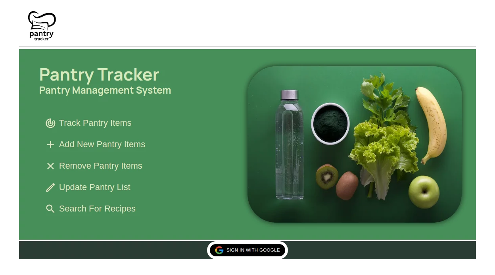
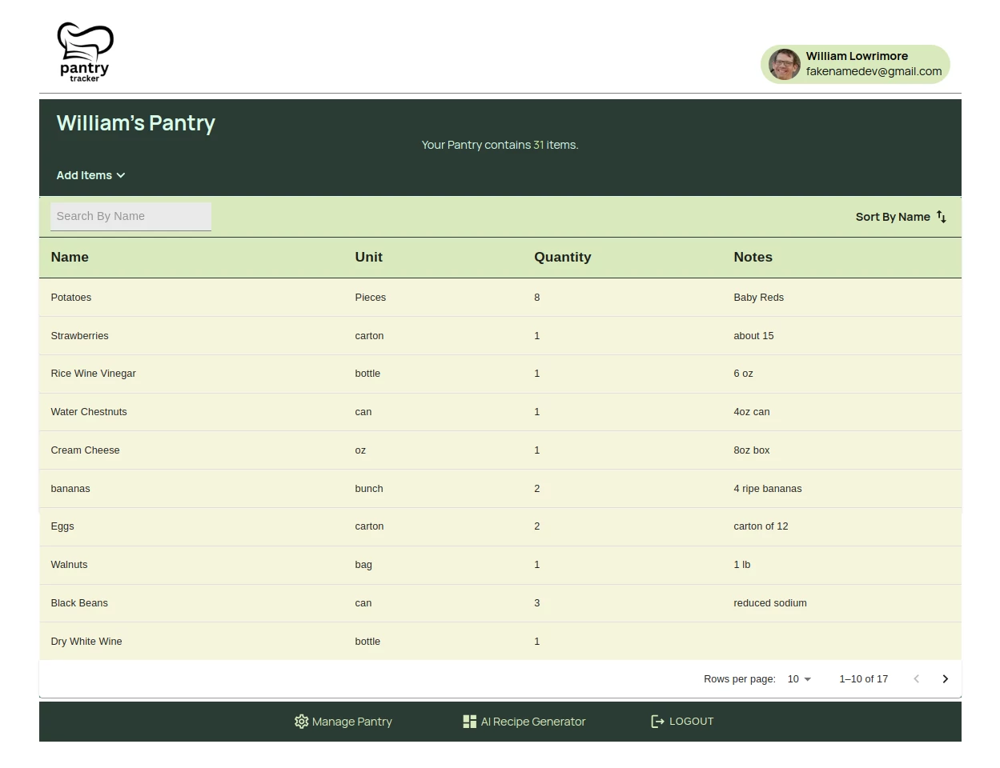
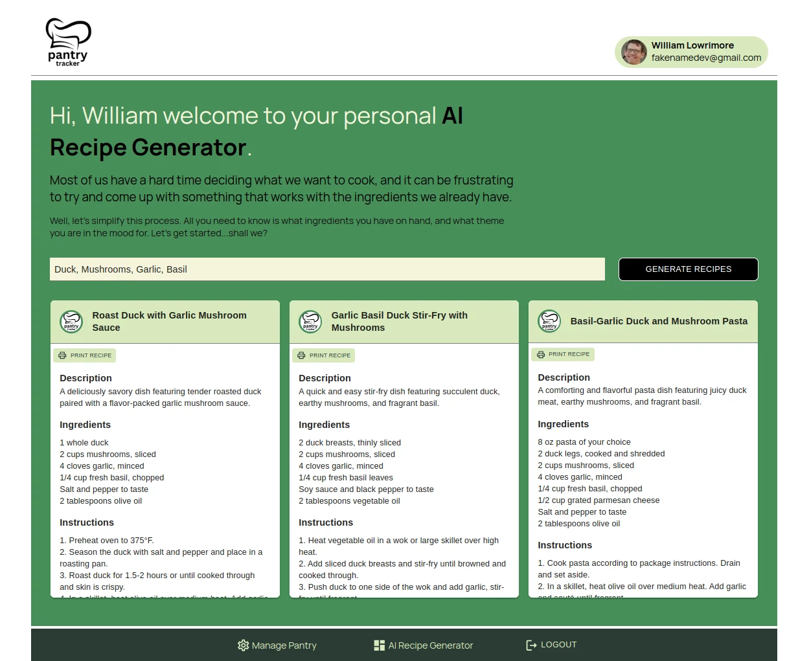

This is a [Next.js](https://nextjs.org/) project bootstrapped with [`create-next-app`](https://github.com/vercel/next.js/tree/canary/packages/create-next-app).

## Headstarter Project 2: Pantry Tracker with AI Recipe Generator

### Getting Started

First, run the development server:

```bash
npm run dev
```

Open [http://localhost:3000](http://localhost:3000) with your browser to see the result.

This project uses [`next/font`](https://nextjs.org/docs/basic-features/font-optimization) to automatically optimize and load Inter, a custom Google Font.

## Technologies Used

- [Next.js](https://nextjs.org)
- [NextAuth](https://nextauth.com)
- [Material UI](https://mui.com)
- [Open AI](https://platform.openai.com)
- [Langchain](NPM)
- [ZOD](NPM)

## Resources

- [NextJS Docs](https://https://nextjs.org/docs)
- [Next Auth Docs](https://https:nextauth.com/docs)
- [Material UI Docs](https://mui.com/docs)
- [Google Docs](https://docs.google.com)
- [OpenAI Docs](https://platform.openai/docs)
- [Codeium AI](https://codeium.com)
- [Gemini AI](https://gemini.google.com)

## Deployed on Vercel





## Contact

- [wlowrimore@gmail.com](mailto://wlowrimore@gmail.com)
- [github/wlowrimore](https://github.com/wlowrimore)
- [williamlowrimore.com](http://williamlowrimore.com)
- [linkedIn/william-lowrimore-dev](https://linkedin.com/in/william-lowrimore-dev)
